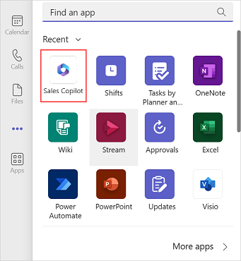
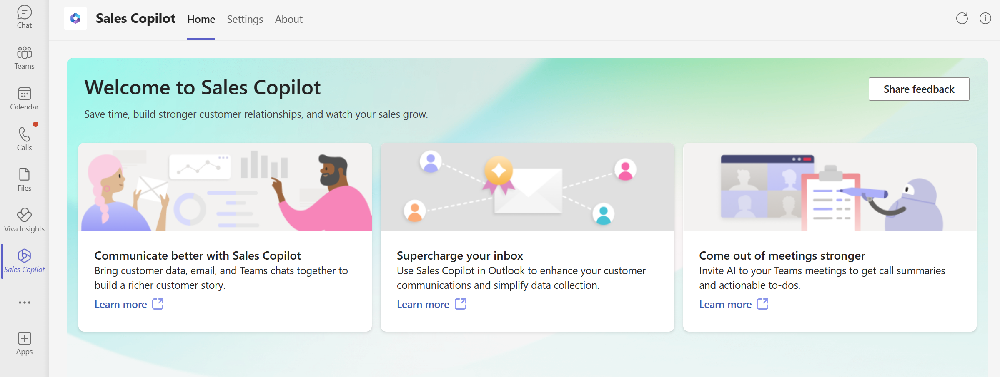
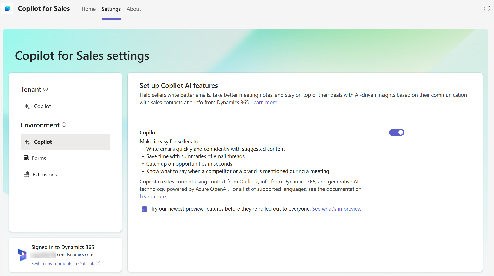
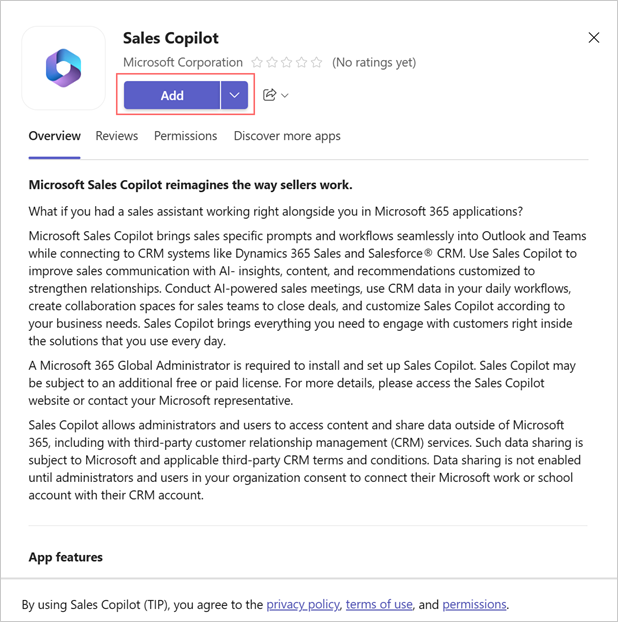

# Administrator settings for Sales Copilot

Sales Copilot can be customized to an organization's business needs. As a tenant administrator or CRM administrator, you can configure administrator settings for Sales Copilot from a central location and control Sales Copilot experience across Outlook and Teams.

As a tenant administrator, you can control who can use AI capabilities in Sales Copilot for all environments in your organization. 

The following tenant-specific administrator setting is available:

- **Setup Copilot AI features**: Allows you to control who can use AI capabilities in Sales Copilot for all environments in your organization. More information: [Set up Copilot AI features](suggested-replies.md#tenant-administrator-settings)

As a CRM administrator, you can manage environment-specific settings for Sales Copilot from a central location and control Sales Copilot experience across Outlook and Teams. For example, you can customize the CRM information displayed in Sales Copilot across Outlook and Teams to give sellers quick access to the fields most relevant to their flow of work.

The following environment-specific administrator settings are available:

- **Set up Copilot AI features**: Helps sellers write better emails and stay on top of their deals with AI-driven insights. More information: [Set up Copilot AI features](suggested-replies.md#crm-administrator-settings).

- **Customize forms and fields**: Allows you to specify what information should be displayed in Sales Copilot across Outlook and Teams. You can also control which records and fields sellers can edit directly in Sales Copilot. More information: [Customize forms and fields](customize-forms-and-fields.md)

- **Integrate with other applications**: Allows you to integrate Sales Copilot with other applications such as Microsoft Viva Topics and People.ai to enhance the functionality of Sales Copilot and adds insights for your sellers. More information: [Integrate with other applications](use-extensions.md).

## Prerequisites

- Sales Copilot app must be added to Teams. More information: [Add the Sales Copilot app to Teams](#add-the-sales-copilot-app-to-teams)
- Administrators must have the latest version of the Sales Copilot app in Teams. For information on updating an app in Teams, see [Update an app in Teams](https://support.microsoft.com/office/update-an-app-in-teams-3d53d136-5c5d-4dfa-9602-01e6fdd8015b).
- Administrator must sign in to Sales Copilot in Outlook.
    1. [Launch Sales Copilot from Outlook](use-sales-copilot-outlook.md).
    2. On the **Welcome to Sales Copilot!** screen, select **Sign in to get started**, and then select your CRM and environment to use. 

> [!IMPORTANT]
> Administrator settings are visible only when you sign in to Sales Copilot in Outlook with your administrator credentials. More information: [Who can access administrator settings?](#who-can-access-administrator-settings)

## Who can access administrator settings?

### Dynamics 365

|Requirement type  |You must have  |
|---------|---------|
|Security role     |  System Administrator or System Customizer  **Note**: If you're using a custom security role, [additional privileges are required to use Sales Copilot](install-viva-sales.md#additional-privileges-required-for-dynamics-365-customers).  |

### Salesforce

|Requirement type  |You must have  |
|---------|---------|
|Permission    |  User profile needs to have **Modify All Data** or **Manage Data Integrations** permission    **Note**: Permissions need to be on the user's profile and not in permission sets assigned to the user.  |

> [!NOTE]
> - If you've made changes in a user's permissions or security roles in your CRM, ask that user to sign out of Sales Copilot in Outlook and then sign in again for these changes to be reflected appropriately. 
> - Changes in user permissions or security roles in CRM can take up to 15 minutes to reflect in Sales Copilot app for Teams.

## Access administrator settings

You can access administrator settings from the Sales Copilot app in Teams. Administrator settings are specific to the CRM environment you sign in to from Sales Copilot in Outlook. Each environment will have its own set of configurations for Sales Copilot. If you want to configure Sales Copilot for another environment, you must [switch environments in Outlook](#how-can-i-switch-crm-environments).

When you open administrator settings, following tabs are available:

- **Home**: Serves as the landing page for the Sales Copilot app.

- **Settings**: Contains all the settings for an administrator.

- **About**: Displays details of the Sales Copilot app.

**To access administrator settings**

1.  Sign in to Microsoft Teams with your administrator credentials.

2.  In the navigation bar on the left, select **Sales Copilot**.

    If **Sales Copilot** isn't visible, select **More added apps** (**…**), and then select **Sales Copilot**.
    
    

    If you see the **Sales Copilot** window asking you to either add or open the app, select **Add** or **Open** to get the latest features.
    
    The **Sales Copilot** app is opened with the **Home** tab selected.
    
    

3.  On the **Settings** tab, update the settings.

    - **Tenant**
        - **Copilot**: [Control who can use AI capabilities](suggested-replies.md#tenant-administrator-settings). 
    - **Environment**
        - **Copilot**: [Set up Copilot AI features](suggested-replies.md#crm-administrator-settings).
        - **Forms**: [Customize forms and fields](customize-forms-and-fields.md).
        - **Extensions**: [Integrate Sales Copilot with other applications](use-extensions.md).

    

## Add the Sales Copilot app to Teams

1.  Sign in to Microsoft Teams with your administrator credentials.

2.  In the navigation bar on the left, select **Apps**.

3. Search for **Sales Copilot** and select it.

4. Select **Add** in the **Sales Copilot** window.

    
    

## FAQ

### Can I access administrator settings if I don't have Microsoft Teams?

No. Administrator settings are currently accessible only through the Sales Copilot app for Teams. 

### Which CRM environment are administrator settings for?

The settings are specific to the environment signed in to from Sales Copilot in Outlook. If you want to customize Sales Copilot for another environment, you must [switch environments in Outlook](#how-can-i-switch-crm-environments).

### How can I switch CRM environments?

Your organization may have multiple environments for you and your sellers to work in. Environments help to reduce the risk of making unintended changes to a production environment, for example. You can test customizations in a development environment to make sure they don’t disrupt your business operations or your customers' experience before you deploy them to your production environment.

You'll need to switch CRM environments from Sales Copilot in Outlook and come back to Sales Copilot app in Teams:

1. [Sign out of Sales Copilot in Outlook](sign-out-sales-copilot.md).
2. In the **Welcome to Sales Copilot!** pane, select **Sign in to get started**, and then select your CRM and environment to use.
3. Come back to Sales Copilot app in Teams and refresh the **Settings** tab to see the new environment.

### Why do I see the message "Sign in to Sales Copilot in Outlook first"?

You need to be signed in to a CRM environment from Sales Copilot in Outlook.

[Launch Sales Copilot from Outlook](use-sales-copilot-outlook.md). On the **Welcome to Sales Copilot!** screen, select **Sign in to get started**, and then select your CRM and environment to use. 

Come back to the Sales Copilot app in Teams and refresh the **Settings** tab. 

### Why do I see the message "Settings are coming soon"?

Personal settings for Sales Copilot will also be accessible through the **Settings** tab, and will be launching soon. If you're a CRM administrator, you should already see administrator settings in the **Settings** tab, and you shouldn't see this message – check that you have the right permissions or security roles. More information: [Who can access administrator settings?](#who-can-access-administrator-settings)

### Can I work with administrator settings from my mobile device?

Mobile device is currently not supported. You must work with administrator settings from a desktop.

### Are the Dark and High Contrast themes from Teams supported?

The Dark and High Contrast themes from Teams are currently not supported. 

